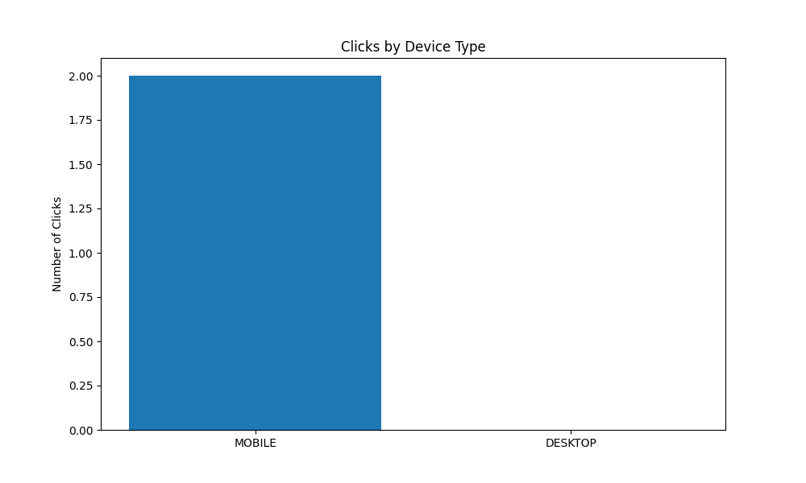
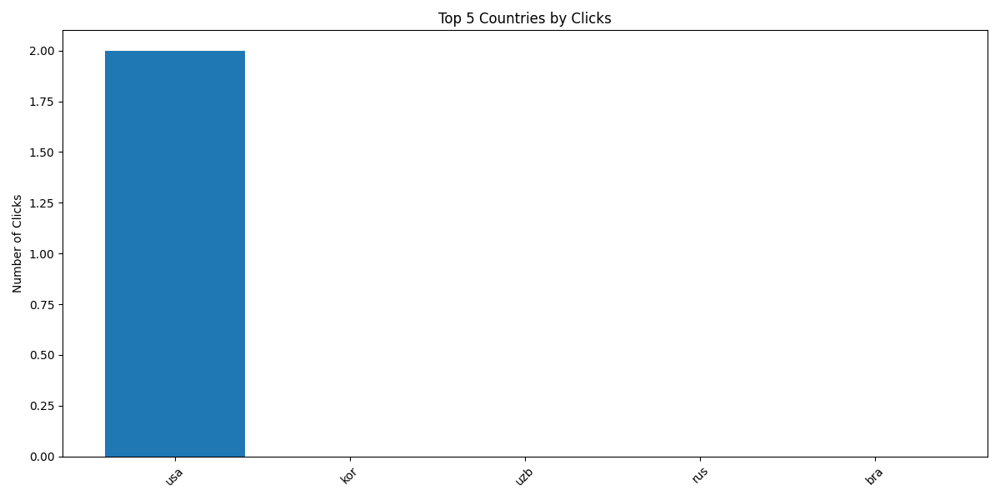
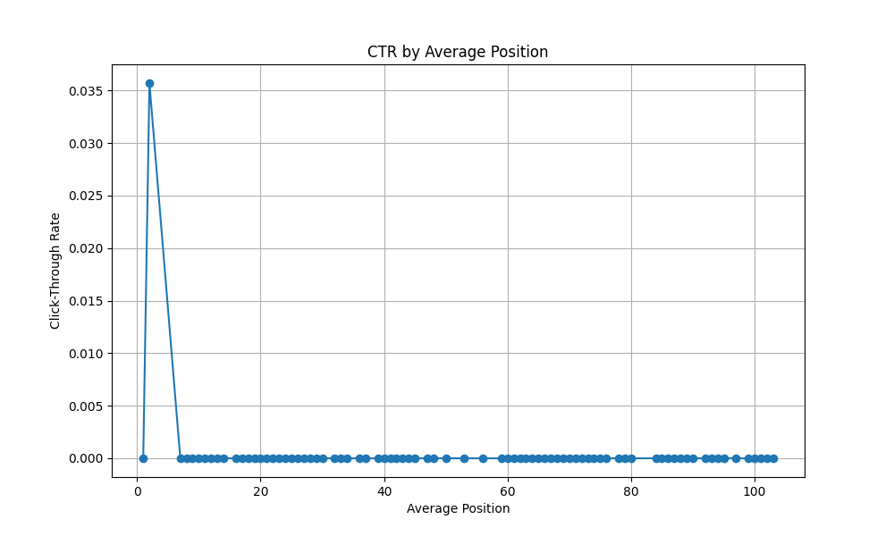

# Google Search Console Performance Report

## Search Performance Overview
**Time Period:** May 12 - May 19, 2025

### Top Performing Queries
| Query | Clicks | Impressions | CTR | Avg. Position |
|-------|--------|-------------|-----|---------------|
| solstice recovery | 2 | 7 | 28.57% | 2.3 |
| california sober living | 0 | 2 | 0.00% | 34.5 |
| free sober living near me | 0 | 1 | 0.00% | 2.0 |
| halfway house | 0 | 1 | 0.00% | 20.0 |
| halfway house in los angeles | 0 | 1 | 0.00% | 18.0 |

### Performance Visualizations

### Key Insights
1. **Branded Search Performance**
   - "solstice recovery" is your top performing query
   - Strong CTR of 28.57% indicates good relevance
   - Excellent average position of 2.3
2. **Device Performance**
   - Top performing device: MOBILE with 2 clicks
   - Mobile devices account for 2 clicks
   - Desktop devices account for 0 clicks
3. **Geographic Performance**
   - Top performing country: usa with 2 clicks
   - Total countries with traffic: 59
   - International reach: 59 countries outside USA
4. **Position Analysis**
   - Total clicks in top 10 positions: 2
   - Best performing position: 2
   - Average CTR for top 10 positions: 1.80%

### Recommendations
1. **International SEO**
   - Create country-specific content
   - Implement hreflang tags for international targeting
   - Optimize for local search in top performing countries
2. **SERP Optimization**
   - Improve meta descriptions for high-impression positions
   - Enhance rich snippets for better CTR
   - Optimize title tags for better click-through rates

---
*Data sourced from Google Search Console API*